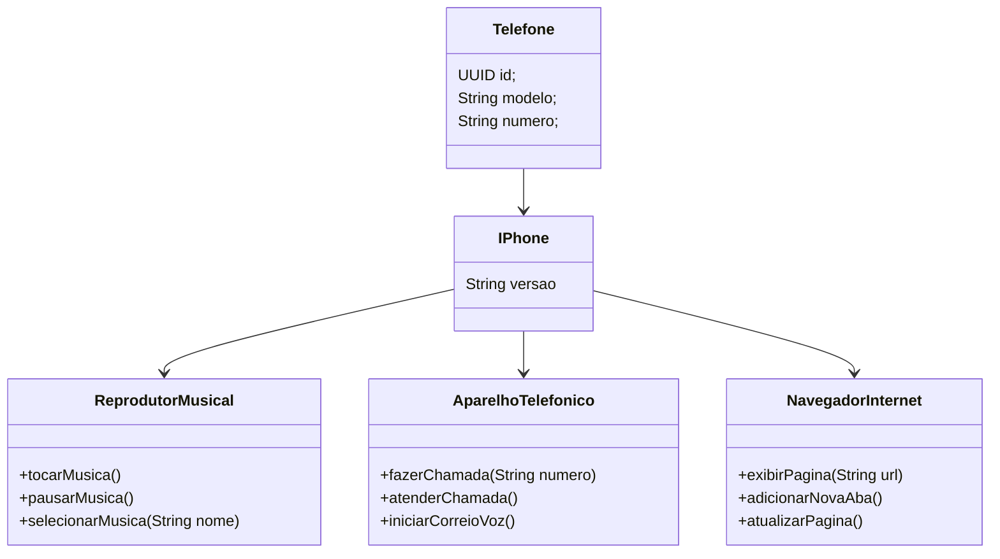

# Desafio POO - Modelagem e Diagramação do iPhone

Este projeto foi desenvolvido para o **Desafio de Programação Orientada a Objetos** da **Trilha Java Básico** da DIO. O objetivo foi modelar e diagramar a representação UML de um iPhone, abrangendo suas funcionalidades principais.

## Funcionalidades

- **Reprodutor Musical**
    - Métodos: `tocar()`, `pausar()`, `selecionarMusica(String musica)`

- **Aparelho Telefônico**
    - Métodos: `ligar(String numero)`, `atender()`, `iniciarCorreioVoz()`

- **Navegador na Internet**
    - Métodos: `exibirPagina(String url)`, `adicionarNovaAba()`, `atualizarPagina()`

## Diagrama UML

O diagrama UML que representa as funcionalidades foi criado com a ferramenta de sua escolha e pode ser visualizado abaixo:

